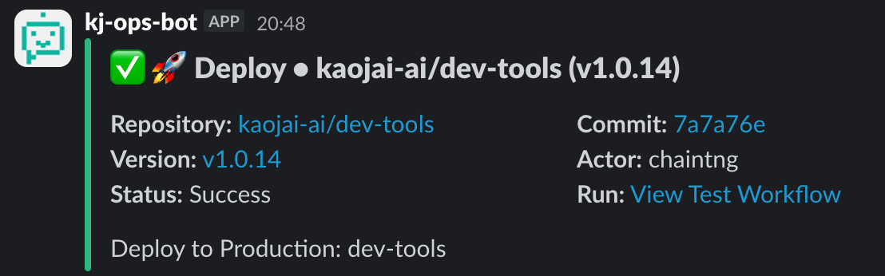
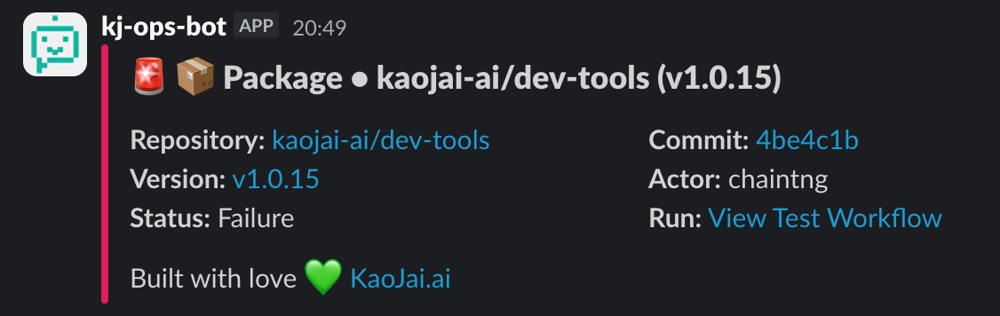

# KaoJai GitHub Actions

Open-source GitHub Actions that streamline CI/CD workflows by improving the feedback loop during every stage of the software delivery lifecycle. The repository currently ships the **Workflow Notify** composite action, a thin wrapper around notification providers (Slack supported today) that publishes the result of any workflow run.

## Repository structure

| Path | Description |
| --- | --- |
| `workflow-notify/` | Composite GitHub Action that prepares a rich status payload and sends it to Slack. |
| `workflow-notify/images/` | Sample screenshots for success and failure notifications. |

## Workflow Notify

`workflow-notify` collects run metadata (repository, branch, triggering actor, commit, and optional semver tags) and emits a rich Slack message that highlights the workflow status. The action is intentionally provider-agnostic so additional destinations can be added later.

### Features

- ✅ Works with any workflow, job, or step—simply guard the action with GitHub's `success()` / `failure()` conditionals.
- ✅ Ships with expressive defaults for titles, message formatting, and emoji while remaining fully configurable through inputs.
- ✅ Uses only official GitHub and Slack actions under the hood.

### Supported providers

| Provider | Status | Notes |
| --- | --- | --- |
| Slack | ✅ Available | Powered by [`slackapi/slack-github-action`](https://github.com/slackapi/slack-github-action). |
| Others | 🚧 Planned | The `provider_name` input is future-proofed for new integrations. |

### Slack notification demo

Success notification example:



Failure notification example:



### Usage

#### Prerequisites

1. Create an [Incoming Webhook](https://api.slack.com/messaging/webhooks) in the target Slack workspace.
2. Store the webhook URL in your repository settings as an encrypted secret, e.g. `SLACK_WEBHOOK_URL`.

#### Notify on success

```yaml
name: release

on:
  push:
    branches:
      - main

jobs:
  build-and-notify:
    runs-on: ubuntu-latest

    steps:
      - name: Run build
        run: |
          npm ci
          npm run build

      - name: Announce success
        if: success()
        uses: kaojai-ai/github-action/workflow-notify@v1
        with:
          slack_webhook_url: ${{ secrets.SLACK_WEBHOOK_URL }}
          channel: cicd-alerts
          prefix: "🚀 Deploy"
          message: |
            *Environment:* production
            *Summary:* Build completed successfully and artifacts were published.
```

#### Notify on failure

```yaml
name: release

on:
  push:
    branches:
      - main

jobs:
  build-and-notify:
    runs-on: ubuntu-latest

    steps:
      - name: Run build
        run: |
          npm ci
          npm run build

      - name: Announce failure
        if: failure()
        uses: kaojai-ai/github-action/workflow-notify@v1
        with:
          slack_webhook_url: ${{ secrets.SLACK_WEBHOOK_URL }}
          channel: cicd-alerts
          prefix: "🚨 Deploy"
          message: |
            *Environment:* production
            *Summary:* Build failed. Check the workflow run for details.
```

### Inputs

#### Mandatory

| Input | Description |
| --- | --- |
| `slack_webhook_url` | Slack Incoming Webhook URL. Store the value in a secret and reference it with `secrets.<NAME>`. |

#### Optional

| Input | Default | Description |
| --- | --- | --- |
| `provider_name` | `slack` | Future-facing provider toggle. Currently only Slack is implemented. |
| `channel` | `package` | Slack channel or conversation to post to. |
| `prefix` | `⚙️ Workflow` | Title prefix shown next to the workflow status. |
| `bot_name` | `kj-ops-bot` | Display name of the Slack bot. |
| `bot_icon_url` | `https://avatars.githubusercontent.com/u/227843191` | Optional avatar URL for the Slack bot. |
| `message` | _empty_ | Rich Slack Markdown body appended under the workflow metadata. |
| `status` | _empty_ | Overrides GitHub's computed job status (`success`, `failure`, `cancelled`, etc.). Leave empty to auto-detect. |
| `version` | _empty_ | Overrides the version shown in the notification. Useful for custom release tags. |

### Tips

- Guard the action with `success()`, `failure()`, or `always()` depending on the desired behavior.
- Combine the optional `message` input with multi-line Markdown to summarize release notes, deployment environments, or changelog highlights.
- When using GitHub environments, consider including `${{ github.ref_name }}` or `${{ github.run_number }}` inside the `message` input for extra context.

### License

Distributed under the [Apache License 2.0](LICENSE).
